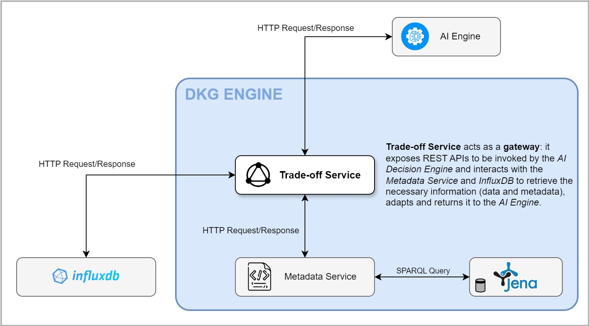

# Trade-Off Service

The **Trade-Off Service** is a microservice that acts as a bridge between
the _DKG Engine_ and _AI Decision Engine_.  
It exposes REST APIs that allow to get information about the cluster status,
interacting with the _Metadata Service_ to get the metadata
stored in the DKG and _InfluxDB_ to retrieve the actual data coming
from the telemetry system.

